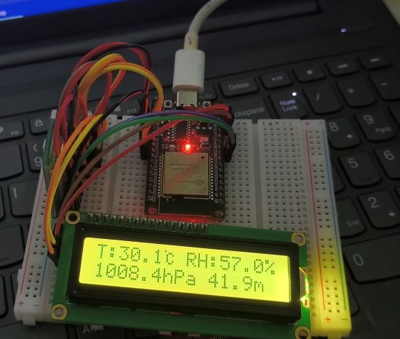

# 使用NanoFramework做一个基于ESP32的温度计

## 硬件准备

### 器件

| 说明                  | 型号           |
| --------------------- | -------------- |
| 气压传感器            | BMP280         |
| 温湿度传感器          | SHT30          |
| 蓝牙模块              | DX-BT24 BLE5.1 |
| 带IIC驱动的1602显示器 | LCD1602        |
| ESP32开发板           | ESP32          |

### 连线
传感器和显示器都挂载到ESP32单片机引出的IIC总线中即可。蓝牙模块通过串口与单片机连接。
